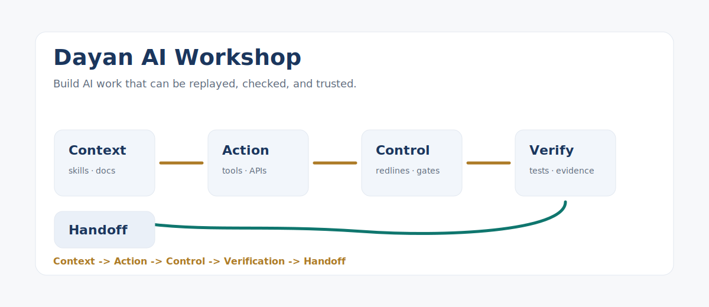

# Dayan AI Workshop

Open workshop for building reliable AI agent workflows.

大衍工坊：给团队打磨 AI 员工、AI 编程工具、自动化脚本和人工审批流程的公开工坊。



> Stop shipping vibes. Build AI work that can be replayed, checked, and trusted.
>
> 别再只交付“看起来很像”的 AI 结果。把 AI 工作做成能回放、能检查、能交接的流程。

## What This Is

Most AI workflow failures do not come from the model alone. They come from missing boundaries:

- nobody knows which data the AI can read;
- nobody knows which actions need approval;
- nobody can replay why a task was accepted as done;
- nobody separates a useful draft from a verified deliverable.

This workshop collects small, reusable building blocks for that layer:

- **Skills**: reusable task instructions and operating procedures.
- **Hooks**: guardrails that stop or warn before risky actions.
- **Verifiers**: acceptance contracts that define what “done” means.
- **Handoffs**: lightweight records that let long-running work survive context switches.
- **Permission redlines**: allow / warn / block rules for AI employees.

## Why Star This

Star this repo if you are building any of these:

- an AI coding workflow that needs tests and review, not just fast edits;
- an internal AI employee that needs permission boundaries;
- a customer-facing AI delivery process that must be verifiable;
- a multi-agent system where context, actions, and acceptance need to be separated;
- an AI operations playbook that should survive beyond one chat session.

If the mission card, verifier template, or permission redline library saves you a few hours of painful trial and error, a star helps more builders find it.

如果这里的任务卡、验收器模板或权限红线库帮你少踩坑，欢迎点个 star，让更多做 AI 工作流的人看到它。

## 中文快速说明

大衍工坊不是一个“提示词合集”，也不是某个私有系统的开源版。

它公开的是一组更底层的工作流构件：

- **Skill**：把重复任务写成可复用操作规程；
- **Redline**：把高风险动作分成允许、提醒、阻断；
- **Verifier**：在交付前定义“怎样才算完成”；
- **Mission Card**：给 AI 员工写清职责、输入、禁区、动作和交接；
- **Workshop Map**：用一张图把 Context / Action / Control / Verification / Handoff 串起来。

适合你用在：

- AI 编程工作流；
- 企业内部 AI 员工试点；
- 多 agent 协作；
- 客户交付前的验收清单；
- 需要长期维护的 AI 自动化流程。

## The Workshop Map

```text
Context        Action        Control        Verification        Handoff
  |              |              |                |                 |
Skills   ->   Tools   ->   Redlines   ->   Verifiers   ->   Status notes
```

The core idea is simple: do not ask one prompt to carry the whole company. Split the work into reusable artifacts.

## P0 Contents

| Path | Use |
|---|---|
| `MANIFESTO.md` | The public stance behind Dayan AI Workshop. |
| `docs/quickstart/build-a-reliable-ai-worker-in-30-min.md` | A fast path from vague AI task to governed workflow. |
| `docs/maps/dayan-workshop-map.md` | One-page architecture map. |
| `docs/gallery/README.md` | Three redacted before / after workflow examples. |
| `examples/ai-worker-mission-card.md` | Copyable mission card for an AI worker. |
| `tools/verify_public_release.py` | Local verifier for public release safety. |
| `drafts/social/` | Launch post drafts for English and Chinese channels. |
| `docs/about/open-source-boundary.md` | What belongs in public, redacted, internal, and secret layers. |
| `docs/glossary/ai-workflow-governance.md` | A plain definition of AI workflow governance. |
| `docs/glossary/verifier.md` | What a verifier is and how to write one. |
| `docs/patterns/skills-hooks-verifiers.md` | A minimal architecture pattern for reliable AI work. |
| `templates/permission-redline-library.md` | A reusable permission matrix for AI agents. |
| `templates/ai-employee-reliability-checkup.md` | A checkup template for evaluating AI employee readiness. |
| `docs/compare/claude-code-vs-codex.md` | A practical comparison for team workflows. |
| `SANITIZATION.md` | Public release checklist and scan record. |
| `llms.txt` | Short index for AI search and citation. |

## Privacy And Security

This repository is designed as a public-safe layer.

- No private customer data.
- No credentials, keys, or environment files.
- No personal memory.
- No machine-specific paths.
- No claim that every AI workflow can be fully automated.

Everything here should be readable without access to any private workspace.

## How To Use

Start with the smallest useful loop:

1. Pick a task your AI assistant performs repeatedly.
2. Write the skill: inputs, steps, output format.
3. Add hooks for actions that require approval.
4. Write a verifier before declaring the task done.
5. Keep a handoff note when the task spans multiple sessions.

For a concrete walkthrough, start here:

`docs/quickstart/build-a-reliable-ai-worker-in-30-min.md`

Run the public-release verifier:

```bash
python3 tools/verify_public_release.py
```

## Status

Public P0 release.

## License

MIT. See `LICENSE`.
